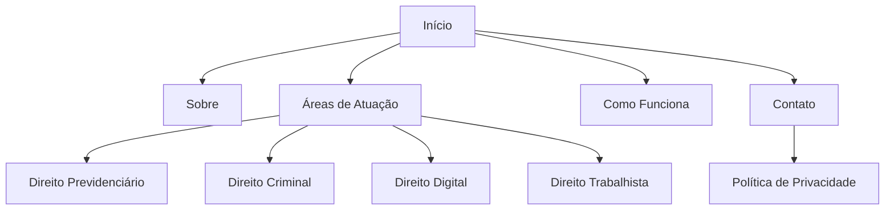
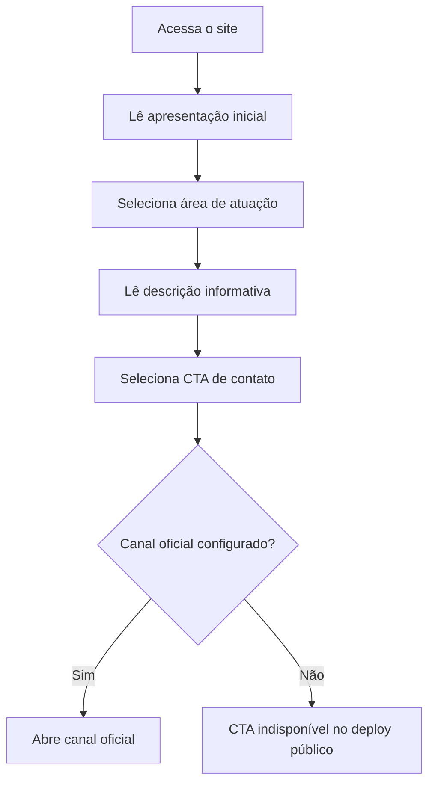
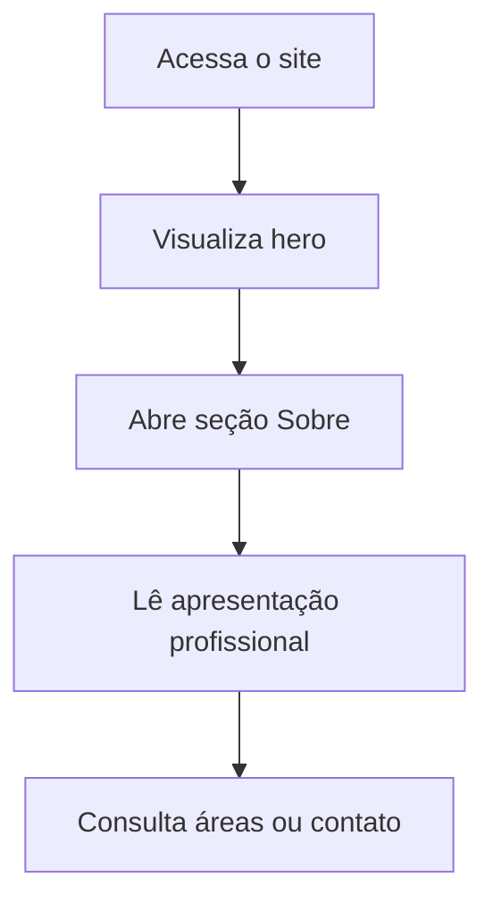

# Advogada Larissa UI/UX Specification

## Introduction

Este documento define a experiência, a arquitetura de informação e a direção visual provisória do site institucional da Advogada Larissa. A especificação deriva de [docs/project-brief.md](./project-brief.md) e [docs/prd.md](./prd.md).

O objetivo é entregar uma experiência clara, sóbria e responsiva para pessoas que buscam atendimento jurídico online em todo o Brasil. A identidade visual proposta é genérica e deve ser revisada quando a cliente fornecer materiais oficiais.

## Overall UX Goals & Principles

### Target User Personas

**Pessoa buscando orientação imediata:** acessa principalmente pelo celular, deseja identificar rapidamente se existe uma área jurídica relacionada ao seu caso e encontrar um canal confiável de contato.

**Pessoa pesquisando uma questão jurídica:** chega por busca ou indicação, precisa compreender a atuação profissional e deseja ler informações introdutórias antes de iniciar contato.

### Usability Goals

- A visitante identifica o atendimento online nacional na primeira dobra.
- As quatro áreas jurídicas ficam acessíveis a partir da página inicial.
- O canal de contato fica disponível em até dois cliques.
- A navegação mobile permanece simples, legível e operável por teclado.
- Conteúdos provisórios podem ser substituídos sem alterar a estrutura das páginas.

### Design Principles

1. **Clareza antes de ornamentação:** títulos objetivos e leitura escaneável.
2. **Sobriedade institucional:** evitar linguagem agressiva, excesso de animação e elementos promocionais inadequados.
3. **Mobile-first:** priorizar contexto de acesso por celular.
4. **Acessibilidade por padrão:** contraste, semântica, teclado e foco visível desde o início.
5. **Sistema reutilizável:** estilos e componentes derivados de tokens centralizados.

### Change Log

| Date | Version | Description | Author |
| --- | --- | --- | --- |
| 2026-05-30 | 0.1 | Especificação UX/UI inicial em modo YOLO | Uma (`@ux-design-expert`) |

## Information Architecture (IA)

### Site Map / Screen Inventory

### Navigation Structure

**Primary Navigation:** Início, Sobre, Áreas de Atuação, Como Funciona e Contato. Em desktop, usar cabeçalho horizontal. Em mobile, usar menu recolhível acessível.

**Secondary Navigation:** Rodapé com repetição dos principais links, política de privacidade e dados profissionais aprovados.

**Breadcrumb Strategy:** dispensável para o MVP caso a solução use página única com âncoras. Se as áreas forem implementadas como páginas separadas, usar breadcrumb simples: `Início > Áreas de Atuação > Área`.

## User Flows

### Identificar Área e Iniciar Contato

**User Goal:** compreender se uma área jurídica está relacionada à necessidade e acessar um canal oficial.

**Entry Points:** página inicial, card de área ou link direto para página de área.

**Success Criteria:** a visitante encontra informação introdutória e alcança um CTA de contato sem fricção.

**Edge Cases & Error Handling:**

- CTA não deve direcionar para dados fictícios.
- Links externos devem indicar destino de forma compreensível.
- Conteúdo deve informar que cada situação depende de análise individual.

### Conhecer a Profissional

**User Goal:** verificar identidade, atuação e formato de atendimento.

**Entry Points:** primeira dobra, menu Sobre ou rodapé.

**Success Criteria:** a visitante compreende que o atendimento é online nacional e encontra dados profissionais aprovados.

## Wireframes & Mockups

**Primary Design Files:** não há arquivo Figma confirmado. Esta especificação orienta a primeira implementação.

### Página Inicial

**Purpose:** apresentar a profissional, áreas atendidas e jornada até contato.

**Key Elements:**

- Cabeçalho com marca provisória, navegação e CTA discreto.
- Hero com mensagem institucional, atendimento online nacional e CTA.
- Bloco Sobre com fotografia provisória ou placeholder editorial adequado.
- Grid de quatro áreas jurídicas.
- Bloco Como Funciona com etapas.
- Bloco final de contato.
- Rodapé com navegação, política de privacidade e dados profissionais.

**Interaction Notes:** usar navegação por âncoras suaves quando apropriado, respeitando `prefers-reduced-motion`.

### Página ou Detalhe de Área

**Purpose:** oferecer informação introdutória sobre uma área jurídica.

**Key Elements:**

- Título da área.
- Texto informativo introdutório.
- Aviso de que a avaliação depende do caso concreto.
- CTA discreto de contato.
- Navegação para demais áreas.

**Interaction Notes:** páginas separadas são preferíveis se melhorarem SEO e clareza; a decisão final pertence ao `@architect`.

### Política de Privacidade

**Purpose:** explicar tratamento de dados e canais de contato.

**Key Elements:**

- Texto aprovado.
- Data de atualização.
- Contato responsável.
- Link de retorno à página inicial.

## Component Library / Design System

**Design System Approach:** sistema pequeno baseado em Atomic Design e tokens CSS. Evitar componentes excessivamente genéricos ou dependências desnecessárias.

### Core Components

#### Button / CTA

**Purpose:** acionar navegação ou contato.

**Variants:** primary, secondary, text-link.

**States:** default, hover, focus-visible, active, disabled.

**Usage Guidelines:** CTAs devem ser informativos e discretos. Não usar linguagem de urgência artificial.

#### Navigation Link

**Purpose:** acessar seções e páginas.

**Variants:** desktop, mobile, footer.

**States:** default, hover, focus-visible, active.

#### Practice Area Card

**Purpose:** apresentar área jurídica com breve descrição.

**Variants:** compact, featured.

**States:** default, hover, focus-within.

#### Section Heading

**Purpose:** sustentar hierarquia visual consistente.

**Variants:** eyebrow + title, title + supporting text.

#### Contact Block

**Purpose:** centralizar chamada institucional e canais oficiais.

**Variants:** inline, final section, footer.

#### Mobile Menu

**Purpose:** disponibilizar navegação em telas pequenas.

**States:** closed, open, focus-visible.

**Usage Guidelines:** controlar foco, atributos ARIA e fechamento por teclado.

## Branding & Style Guide

### Visual Identity

**Brand Guidelines:** identidade provisória genérica. Direção visual: escritório jurídico contemporâneo, elegante e acolhedor, com bastante espaço em branco e composição editorial. Não reproduzir a identidade da referência.

### Color Palette

| Color Type | Hex Code | Usage |
| --- | --- | --- |
| Primary | `#173B3F` | Cabeçalhos, fundos institucionais e elementos de destaque |
| Secondary | `#C6A56B` | Detalhes, divisores e destaques discretos |
| Accent | `#E9F0EE` | Fundos suaves e superfícies auxiliares |
| Success | `#2F6B4F` | Feedback positivo |
| Warning | `#9A6B22` | Avisos |
| Error | `#A23B3B` | Erros |
| Neutral | `#1F2929`, `#5A6868`, `#F7F5F0`, `#FFFFFF` | Texto, bordas e fundos |

### Typography

#### Font Families

- **Primary:** `Inter`, `system-ui`, sans-serif.
- **Secondary:** `Cormorant Garamond`, Georgia, serif.
- **Monospace:** não necessário para a interface pública.

#### Type Scale

| Element | Size | Weight | Line Height |
| --- | --- | --- | --- |
| H1 | `clamp(2.5rem, 6vw, 4.75rem)` | 600 | 1.05 |
| H2 | `clamp(2rem, 4vw, 3rem)` | 600 | 1.1 |
| H3 | `1.375rem` | 600 | 1.25 |
| Body | `1rem` | 400 | 1.7 |
| Small | `0.875rem` | 400 | 1.5 |

### Iconography

**Icon Library:** conjunto consistente e simples, escolhido pela arquitetura. Ícones devem ser auxiliares e não substituir rótulos essenciais.

### Spacing & Layout

**Grid System:** container com largura máxima entre `1120px` e `1200px`, margens fluidas e grid de 12 colunas em desktop.

**Spacing Scale:** tokens derivados de múltiplos de `4px`, com uso principal de `8`, `16`, `24`, `32`, `48`, `64` e `96px`.

## Accessibility Requirements

### Compliance Target

**Standard:** WCAG 2.2 AA.

### Key Requirements

**Visual:**

- Color contrast ratios: mínimo de `4.5:1` para texto normal e `3:1` para texto grande e elementos gráficos relevantes.
- Focus indicators: visíveis e consistentes.
- Text sizing: conteúdo permanece legível com zoom de até 200%.

**Interaction:**

- Keyboard navigation: todos os controles interativos devem ser acessíveis por teclado.
- Screen reader support: landmarks, headings e atributos ARIA usados quando necessários.
- Touch targets: alvos interativos com tamanho adequado para toque.

**Content:**

- Alternative text: imagens informativas devem possuir texto alternativo.
- Heading structure: hierarquia lógica sem saltos inadequados.
- Form labels: obrigatórios se formulário for aprovado futuramente.

### Testing Strategy

Executar auditoria automatizada e validação manual de teclado, foco, contraste, headings e leitura básica por tecnologia assistiva.

## Responsiveness Strategy

### Breakpoints

| Breakpoint | Min Width | Max Width | Target Devices |
| --- | --- | --- | --- |
| Mobile | `0` | `767px` | Smartphones |
| Tablet | `768px` | `1023px` | Tablets e telas intermediárias |
| Desktop | `1024px` | `1439px` | Notebooks e desktops |
| Wide | `1440px` | - | Telas amplas |

### Adaptation Patterns

**Layout Changes:** grids de áreas passam de uma coluna para duas e quatro colunas conforme espaço disponível.

**Navigation Changes:** desktop usa menu horizontal; mobile usa menu recolhível.

**Content Priority:** hero, áreas de atuação e contato permanecem prioritários em mobile.

**Interaction Changes:** CTAs mantêm área de toque confortável e conteúdo textual direto.

## Animation & Micro-interactions

### Motion Principles

Usar movimento com moderação. Transições devem apoiar compreensão e nunca atrasar acesso ao conteúdo. Respeitar `prefers-reduced-motion`.

### Key Animations

- **Hover de CTA:** mudança discreta de cor e borda (`150ms`, `ease-out`).
- **Abertura do menu mobile:** transição curta de opacidade e deslocamento (`180ms`, `ease-out`).
- **Entrada de conteúdo:** opcional e restrita a elementos não essenciais (`240ms`, `ease-out`).

## Performance Considerations

### Performance Goals

- **Page Load:** conteúdo principal perceptível rapidamente em conexão móvel comum.
- **Interaction Response:** feedback visual imediato.
- **Animation FPS:** manter animações simples e fluidas.

### Design Strategies

- Otimizar imagens e evitar mídia pesada na primeira dobra.
- Limitar fontes e pesos tipográficos.
- Evitar bibliotecas visuais grandes para interações simples.
- Priorizar HTML semântico e conteúdo renderizado de forma indexável.

## Open Decisions

- Receber logotipo, fotografia, biografia e dados oficiais.
- Confirmar se áreas serão páginas separadas ou seções extensas.
- Confirmar canal principal de contato.
- Confirmar se formulário será necessário.
- Confirmar CMS ou blog somente para fase posterior.

## Next Steps

### Immediate Actions

1. Criar arquitetura frontend.
2. Definir stack e estratégia de geração estática.
3. Mapear conteúdo provisório para configuração centralizada.
4. Validar páginas de áreas separadas para SEO.
5. Criar stories implementáveis após validação do `@po`.

### Design Handoff Checklist

- [x] Fluxos principais documentados.
- [x] Inventário de componentes definido.
- [x] Requisitos de acessibilidade definidos.
- [x] Estratégia responsiva definida.
- [x] Identidade provisória incorporada.
- [x] Metas de desempenho estabelecidas.

## Checklist Results

Especificação inicial pronta para handoff ao `@architect`. Identidade e contatos permanecem provisórios até aprovação da cliente.
